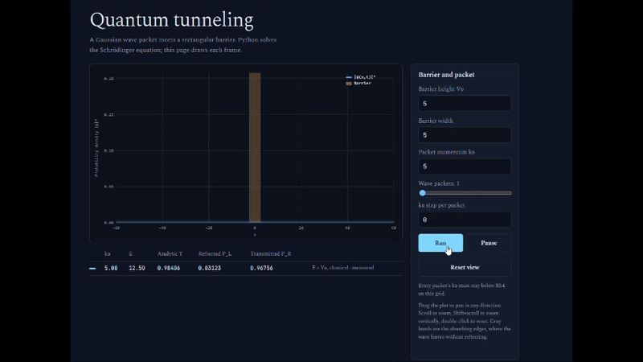

# Quantum Tunneling

A Gaussian wave packet meets a rectangular potential barrier. A Python
backend solves the time-dependent Schrödinger equation frame by frame; a
browser frontend draws it live.



Every formula the simulator uses -- the Schrödinger equation, the
split-step method, the Nyquist limit, the analytic transmission
coefficients, and the measurement criterion -- is written out in full in
[`docs/Quantum_Tunneling_Formulas.pdf`](docs/Quantum_Tunneling_Formulas.pdf),
each one linked to exactly where it's used in `server.py`.

## What it simulates

With $\hbar = m = 1$:

$$
i \frac{\partial \psi}{\partial t} = -\frac{1}{2}\frac{\partial^2 \psi}{\partial x^2} + V(x)\,\psi
$$

solved via the **split-step Fourier method** (Strang splitting): the
kinetic term is solved exactly in Fourier space, and the potential term is
applied as two half-steps around it:

$$
\psi \leftarrow e^{-iV\,dt/2}\,\psi
\qquad
\psi \leftarrow \mathrm{IFFT}\!\left[\, e^{-i k^2 dt/2}\, \mathrm{FFT}[\psi] \,\right]
\qquad
\psi \leftarrow e^{-iV\,dt/2}\,\psi
$$

The barrier is a rectangular potential of height $V_0$ and width $w$. The
packet's central energy is $E = k_0^2/2$; when $E < V_0$, classical
mechanics forbids the particle from ever reaching the other side — quantum
mechanics allows it anyway, with a transmission probability given by the
exact rectangular-barrier formula:

$$
T = \left[\, 1 + \frac{V_0^2 \sinh^2(\kappa w)}{4E(V_0-E)} \,\right]^{-1}
\qquad \kappa = \sqrt{2(V_0-E)} \quad (E < V_0)
$$

with the analogous $\sin^2$ form when $E > V_0$. The app computes this
single-energy estimate alongside the simulated result for comparison — the
simulated value typically comes out a little higher, since the packet
carries a small spread of momenta (and therefore energies) around $k_0$,
not a single exact value.

### Multiple packets

The app supports launching several wave packets at once, each with a
different $k_0$ (set via a base momentum and a step $dk$ per packet), so
you can compare how transmission changes with energy side by side, since
the Schrödinger equation is linear and each packet evolves independently
in the same barrier.

### Avoiding a numerical artifact

FFT methods implicitly treat the spatial grid as periodic (a closed loop).
Left uncorrected, a packet that exits one edge reappears at the other and
can re-hit the *same* barrier again, eventually leaking most of the
probability through after enough simulated time — a finite-box artifact,
not real physics. This is fixed with an absorbing layer near both edges
that damps the wavefunction smoothly before it can wrap around.

## Project structure

```
.
├── server.py          # Flask backend: physics + HTTP API
├── launch.pyw          # double-click launcher (no console window)
├── requirements.txt
├── static/
│   └── index.html     # frontend: plot, controls, polling loop
├── assets/
│   └── demo.gif
└── docs/
    └── Quantum_Tunneling_Formulas.pdf   # every formula, linked to its code
```

## Setup

```bash
pip install -r requirements.txt
```

## Usage

```bash
python server.py
```

This starts a local server and opens `http://127.0.0.1:8000` in your
browser automatically. Closing the browser tab (or leaving it idle for a
while) shuts the server down on its own.

On Windows, `launch.pyw` does the same thing without opening a console
window, if you'd rather double-click it directly.

### Controls

- **Barrier height $V_0$ / width** — shape of the rectangular barrier
- **Packet momentum $k_0$** / **wave packets** / **$k_0$ step per packet** —
  launch one or several packets at different energies at once
- **Run** / **Pause** — start a fresh simulation / freeze the current one
- **Reset view** — return to the default zoom
- Drag to pan, scroll to zoom, Shift+scroll to zoom vertically,
  double-click to reset the view

Every packet's $k_0$ must stay below the grid's safe maximum (shown in the
sidebar) — above it, a packet aliases on the grid and appears to move the
wrong way; raise `N` in `server.py` to allow higher momenta.

## License

MIT — see [LICENSE](LICENSE).
